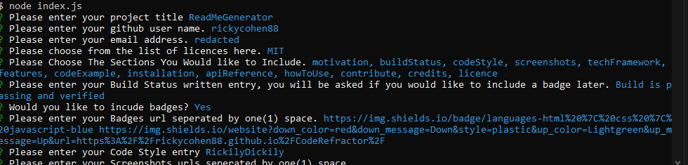
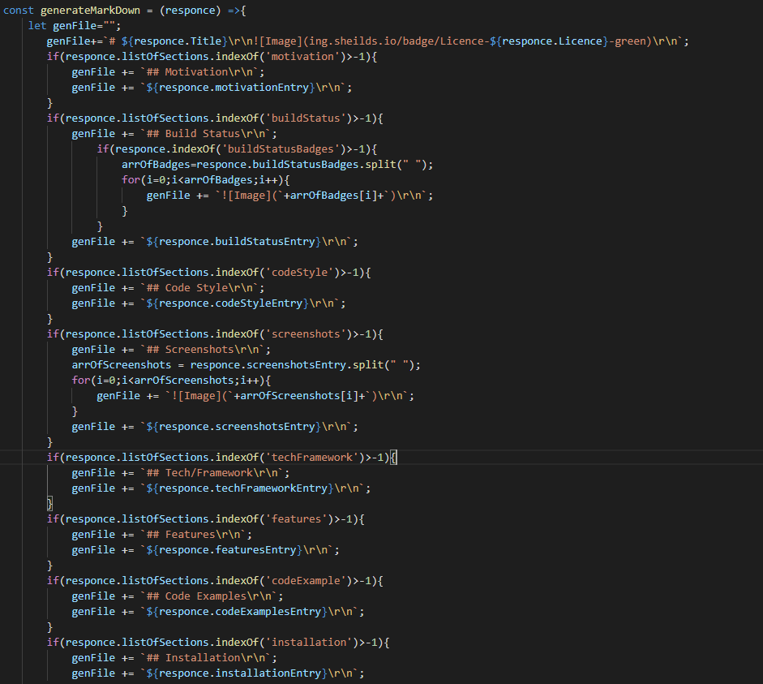

# Read Me Generator

## Description

A node Progran that creates a readme in markdown

## Table of Contents

[Licence](#Licence)

[Questions](#Questions)

[motivation](#motivation)

[buildStatus](#buildStatus)

[codeStyle](#codeStyle)

[screenshots](#screenshots)

[techFramework](#techFramework)

[features](#features)

[codeExample](#codeExample)

[installation](#installation)

[apiReference](#apiReference)

[howToUse](#howToUse)

[contribute](#contribute)

[credits](#credits)

[licence](#licence)

## Motivation 

To creat a program that creates readme(s) to make life easier

## Build Status 

its passing 

## Code Style 

Slopppyy

## Screenshots 

## Tech/Framework 

node(fs,util) and npm inquirer

## Features 

it creates links and headers automatically aswell as creates a table of contents

## Code Examples 

## Installation 

down load and install node then download these files

## API Reference 

none

## How To Use 

After you have the appropriate materials, you will need to open the console and rum an npm install on the files to retrive and download the dependencies[npm i ] after that create a node instance of the program- go to in in the console/terminal then type[node index.js] then follow the prompts

## Questions? 

 [Github](https://github.com/rickcohen88)

Email:<redacted@redacted.com>

## Contribute 

please feel free to open issues on the repos page

## Credits 

me myself and i

## Licence 

 Copyright (c) <2020> <rickcohen88>

                Permission is hereby granted, free of charge, to any person obtaining a copy
                of this software and associated documentation files (the "Software"), to deal
                in the Software without restriction, including without limitation the rights
                to use, copy, modify, merge, publish, distribute, sublicense, and/or sell
                copies of the Software, and to permit persons to whom the Software is
                furnished to do so, subject to the following conditions:
                
                The above copyright notice and this permission notice shall be included in all
                copies or substantial portions of the Software.
                
                THE SOFTWARE IS PROVIDED "AS IS", WITHOUT WARRANTY OF ANY KIND, EXPRESS OR
                IMPLIED, INCLUDING BUT NOT LIMITED TO THE WARRANTIES OF MERCHANTABILITY,
                FITNESS FOR A PARTICULAR PURPOSE AND NONINFRINGEMENT. IN NO EVENT SHALL THE
                AUTHORS OR COPYRIGHT HOLDERS BE LIABLE FOR ANY CLAIM, DAMAGES OR OTHER
                LIABILITY, WHETHER IN AN ACTION OF CONTRACT, TORT OR OTHERWISE, ARISING FROM,
                OUT OF OR IN CONNECTION WITH THE SOFTWARE OR THE USE OR OTHER DEALINGS IN THE
                SOFTWARE.